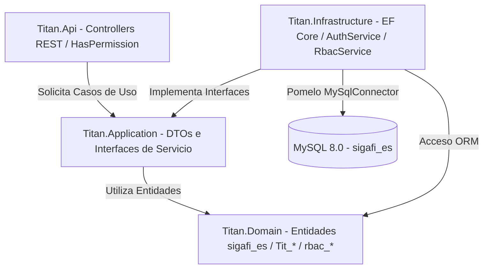

# Arquitectura General .NET 8 y Clean Architecture — Sistema Titán

## 1. Principios de Arquitectura

El backend del sistema Titán está implementado en C# utilizando la plataforma **.NET 8** y sigue los principios de **Clean Architecture** (Arquitectura Limpia). El objetivo central es mantener la lógica de negocio desacoplada de marcos de trabajo técnicos, motores de base de datos y protocolos de transporte.

### Principios Básicos:
1. **Independencia de Capas:** La capa de Dominio no posee dependencias externas. La capa de Aplicación depende únicamente del Dominio. La Infraestructura y la API implementan e invocan las interfaces definidas por Aplicación.
2. **Inversión de Control (IoC):** Las dependencias entre servicios se resuelven mediante el contenedor nativo de Inyección de Dependencias de .NET en `Titan.Infrastructure/DependencyInjection.cs`.
3. **Persistencia Abstraída:** Las consultas y mutaciones a la base de datos MySQL `sigafi_es` se gestionan mediante Entity Framework Core 8 a través del DbContext central `TitanDbContext`.

---

## 2. Diagrama de Capas de la Solución



---

## 3. Estructura de Proyectos C#

```
backend/src/
├── Titan.Domain/               <- Núcleo del Dominio (Sin dependencias externas)
│   ├── Entities/               <- Entidades mapeadas de MySQL (alumnos, carreras, Tit_*, rbac_*)
│   ├── Enums/                  <- Enumeraciones del sistema
│   └── Interfaces/             <- Interfaces de infraestructura base (IPasswordHasher, IJwtTokenGenerator)
│
├── Titan.Application/          <- Contratos de Aplicación y DTOs
│   ├── DTOs/
│   │   ├── Academico/          <- CarreraResponseDto, PeriodoResponseDto, AsignaturaResponseDto
│   │   ├── Actores/            <- AlumnoResponseDto, ProfesorResponseDto, AptitudTitulacionResponseDto
│   │   ├── Auth/               <- LoginRequestDto, LoginResponseDto, UserPermissionsDto
│   │   └── Rbac/               <- DTOs de gestión de roles y permisos
│   └── Interfaces/             <- IAcademicoService, IActoresService, IAuthService, IRbacManagementService
│
├── Titan.Infrastructure/       <- Implementación Técnica y Persistencia
│   ├── Data/
│   │   └── TitanDbContext.cs   <- DbContext de Entity Framework Core mapeado a sigafi_es
│   ├── Security/
│   │   ├── PasswordHasher.cs   <- Hashing de contraseñas
│   │   └── JwtTokenGenerator.cs<- Emisión de JWT Bearer
│   ├── Services/               <- AcademicoService, ActoresService, AuthService, RbacService
│   └── DependencyInjection.cs  <- Registro de servicios en IServiceCollection
│
└── Titan.Api/                  <- Capa de Presentación REST HTTP
    ├── Attributes/             <- HasPermissionAttribute
    ├── Controllers/            <- AcademicoController, ActoresController, AuthController, RbacController
    ├── Extensions/             <- Extensiones de Claims y Configuración
    ├── Program.cs              <- Configuración de pipeline, CORS y Middlewares
    └── appsettings.json
```

---

## 4. Matriz de Componentes del Backend

| Proyecto | Componentes Clave | Propósito Técnico |
|---|---|---|
| `Titan.Domain` | Entidades SQL (`alumnos`, `carreras`, `Tit_PostulacionAlumnos`, `rbac_usuario_rol`) | Modelado de datos relacionales sin dependencias externas. |
| `Titan.Application` | `IAcademicoService`, `IActoresService`, `IAuthService`, `IRbacManagementService` | Definición de contratos de negocio y DTOs de transferencia. |
| `Titan.Infrastructure` | `TitanDbContext`, `AuthService`, `JwtTokenGenerator` | Acceso a MySQL `sigafi_es`, encriptación y emisión de tokens. |
| `Titan.Api` | `AcademicoController`, `ActoresController`, `AuthController`, `RbacController` | Exposición de endpoints REST bajo `/api/v1/`. |
