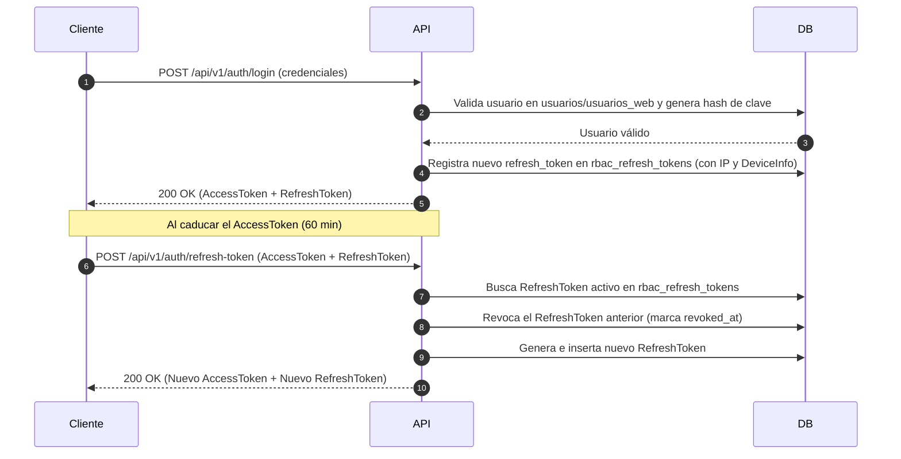

# Autenticación JWT y Rotación de Refresh Tokens — Sistema Titulación ISTPET

## 1. Mecanismo de Autenticación

El sistema Titulación ISTPET utiliza JSON Web Tokens (JWT) firmados mediante la clave secreta institucional con el algoritmo **HMAC-SHA256 (HS256)**.

### 1.1. Propiedades del Token JWT

- **Emisor (`iss`):** Definido en `appsettings.json` (`JwtSettings:Issuer`).
- **Audiencia (`aud`):** Definido en `appsettings.json` (`JwtSettings:Audience`).
- **Duración de Access Token:** 60 minutos por defecto.
- **Duración de Refresh Token:** 7 días por defecto.

---

## 2. Flujo de Rotación de Refresh Tokens (Token Rotation)

Para evitar ataques de reutilización de tokens interceptados, los refresh tokens se almacenan en la tabla `rbac_refresh_tokens` de la base de datos `sigafi_es` en forma de hash SHA-256.



---

## 3. Especificación de Endpoints del AuthController (`/api/v1/auth`)

### 3.1. `POST /api/v1/auth/login`
Inicia sesión y genera el par inicial de tokens.

- **Autorización:** `[AllowAnonymous]`
- **Cuerpo de Petición (`LoginRequestDto`):**
```json
{
  "usernameOrEmail": "estudiante@institutotraversari.edu.ec",
  "password": "Password123!",
  "systemCode": "TITULACION"
}
```
- **Respuesta de Éxito (`200 OK` - `LoginResponseDto`):**
```json
{
  "accessToken": "eyJhbGciOiJIUzI1NiIsInR5cCI6IkpXVCJ9...",
  "refreshToken": "e3b0c44298fc1c149afbf4c8996fb92427ae41e4649b934ca495991b7852b855",
  "expiresIn": 3600,
  "tokenType": "Bearer"
}
```

---

### 3.2. `POST /api/v1/auth/refresh-token`
Renueva el par de tokens caducado.

- **Autorización:** `[AllowAnonymous]`
- **Cuerpo de Petición (`RefreshTokenRequestDto`):**
```json
{
  "accessToken": "eyJhbGciOiJIUzI1NiIsInR5cCI6IkpXVCJ9...",
  "refreshToken": "e3b0c44298fc1c149afbf4c8996fb92427ae41e4649b934ca495991b7852b855"
}
```
- **Respuesta de Éxito (`200 OK`):** Retorna `LoginResponseDto` con nuevo token de acceso y nuevo refresh token.

---

### 3.3. `POST /api/v1/auth/logout`
Cierra la sesión del usuario revocando el refresh token especificado.

- **Autorización:** `[Authorize]`
- **Cuerpo de Petición:** `RefreshTokenRequestDto`
- **Respuesta de Éxito (`200 OK`):** `{ "message": "Sesión cerrada exitosamente." }`

---

### 3.4. `GET /api/v1/auth/me`
Retorna los datos del usuario autenticado, sus roles activos y su matriz de permisos.

- **Autorización:** `[Authorize]`
- **Parámetros de Consulta:** `systemCode` (opcional, por defecto `"TITULACION"`).
- **Respuesta de Éxito (`200 OK` - `UserPermissionsDto`):**
```json
{
  "userId": 42,
  "username": "jorge.doicela",
  "email": "estudiante@institutotraversari.edu.ec",
  "roles": ["ESTUDIANTE"],
  "permissions": ["ACADEMICO_CONSULTAR", "ACTORES_CONSULTAR"]
}
```


