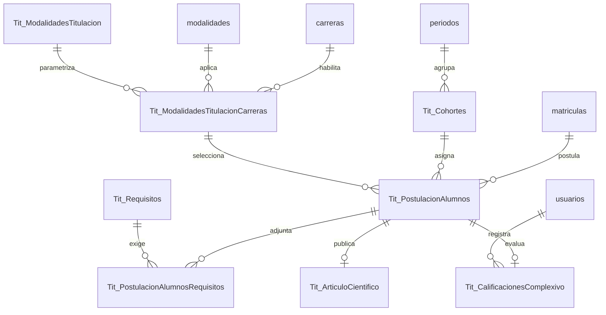

# Esquema Relacional SIGAFI y Módulo Titulación — Sistema Titán

## 1. Integración de la Base de Datos (`sigafi_es`)

El sistema Titán opera directamente sobre la base de datos MySQL **`sigafi_es`** del Instituto Tecnológico Superior Traversari. Las tablas del sistema se dividen en dos grupos:

1. **Tablas Core SIGAFI:** Tablas existentes de gestión académica e institucional (`alumnos`, `profesores`, `carreras`, `periodos`, `matriculas`, `asignaturas`, `modalidades`).
2. **Tablas del Módulo `Tit_*`:** Tablas creadas para la parametrización, postulación y calificación del proceso de titulación.

---

## 2. Diagrama Entidad-Relación (Módulo `Tit_*`)

---

## 3. Diccionario de Datos de Tablas `Tit_*`

### 3.1. `Tit_ModalidadesTitulacion`
Catálogo de modalidades de titulación disponibles en el ISTPET.

| Columna | Tipo de Dato | Clave | Descripción |
|---|---|---|---|
| `idModalidadTitulacion` | `INT AUTO_INCREMENT` | PK | Identificador único de la modalidad. |
| `modalidadTitulacion` | `VARCHAR(100)` | | Nombre de la modalidad. |
| `esComplexivo` | `TINYINT` | | Flag Examen Complexivo (1: Sí, 0: No). |
| `esArticuloCientifico` | `TINYINT` | | Flag Artículo Científico (1: Sí, 0: No). |
| `generaTesis` | `TINYINT` | | Flag Proyecto / Tesis (1: Sí, 0: No). |
| `activo` | `TINYINT` | | Estado del registro (1: Activo, 0: Inactivo). |

---

### 3.2. `Tit_ModalidadesTitulacionCarreras`
Asociación entre carreras institucionales y modalidades de titulación autorizadas.

| Columna | Tipo de Dato | Clave | Referencia |
|---|---|---|---|
| `idModalidadTitulacionCarrera` | `INT AUTO_INCREMENT` | PK | |
| `idCarrera` | `INT` | FK | `carreras(idCarrera)` |
| `idModalidad` | `INT` | FK | `modalidades(idModalidad)` |
| `idModalidadTitulacion` | `INT` | FK | `Tit_ModalidadesTitulacion(idModalidadTitulacion)` |
| `fechaRegistro` | `DATETIME` | | |
| `activo` | `TINYINT` | | |

---

### 3.3. `Tit_Cohortes`
Períodos académicos configurados para convocatorias de titulación.

| Columna | Tipo de Dato | Clave | Referencia |
|---|---|---|---|
| `idCohorte` | `INT AUTO_INCREMENT` | PK | |
| `idPeriodo` | `VARCHAR(20)` | FK | `periodos(idPeriodo)` |
| `descripcion` | `VARCHAR(100)` | | |
| `fechaRegistro` | `DATETIME` | | |
| `activo` | `TINYINT` | | |

---

### 3.4. `Tit_PostulacionAlumnos`
Expediente central de postulación del estudiante.

| Columna | Tipo de Dato | Clave | Referencia |
|---|---|---|---|
| `idPostulacionAlumno` | `INT AUTO_INCREMENT` | PK | |
| `idMatricula` | `INT` | FK | `matriculas(idMatricula)` |
| `idCohorte` | `INT` | FK | `Tit_Cohortes(idCohorte)` |
| `idModalidadTitulacionCarrera` | `INT` | FK | `Tit_ModalidadesTitulacionCarreras(idModalidadTitulacionCarrera)` |
| `estadoPostulacion` | `VARCHAR(50)` | | Valores: `PENDIENTE`, `APROBADA`, `RECHAZADA`. |
| `observacion` | `VARCHAR(500)` | | |

---

### 3.5. `Tit_CalificacionesComplexivo`
Registro de evaluaciones para la modalidad de Examen Complexivo.

| Columna | Tipo de Dato | Clave | Referencia |
|---|---|---|---|
| `idCalificacionComplexivo` | `INT AUTO_INCREMENT` | PK | |
| `idPostulacionAlumno` | `INT` | FK | `Tit_PostulacionAlumnos(idPostulacionAlumno)` |
| `calificacionTeorica` | `DECIMAL(5,2)` | | Nota examen teórico (0.00 - 10.00). |
| `calificacionPractica` | `DECIMAL(5,2)` | | Nota caso práctico (0.00 - 10.00). |
| `calificacionDefensa` | `DECIMAL(5,2)` | | Nota defensa oral (0.00 - 10.00). |
| `promedioFinal` | `DECIMAL(5,2)` | | Nota promedio consolidada. |
| `idUsuarioRegistra` | `INT` | FK | `usuarios(idUsuario)` |

---

### 3.6. `Tit_ArticuloCientifico`
Registro del trabajo científico publicado o sometido.

| Columna | Tipo de Dato | Clave | Referencia |
|---|---|---|---|
| `idArticuloCientifico` | `INT AUTO_INCREMENT` | PK | |
| `idPostulacionAlumno` | `INT` | FK | `Tit_PostulacionAlumnos(idPostulacionAlumno)` |
| `revista` | `VARCHAR(150)` | | Nombre de la revista indexada. |
| `impacto` | `VARCHAR(100)` | | Cuartil / Factor de impacto. |
| `tema` | `VARCHAR(1000)` | | Título del artículo científico. |
| `enlace` | `VARCHAR(500)` | | URL o DOI de la publicación. |
| `archivoPdf` | `VARCHAR(255)` | | Ruta del archivo PDF adjunto. |
