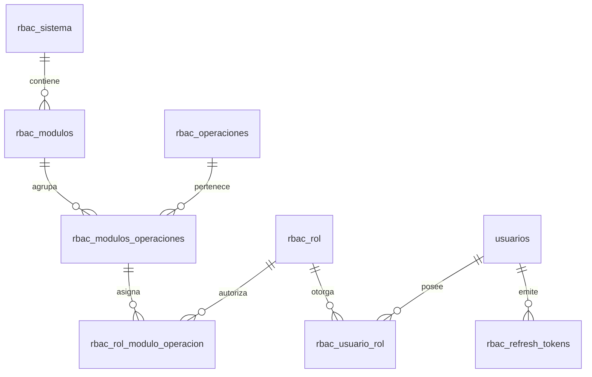

# Modelo Relacional de Seguridad RBAC — Sistema Titán

## 1. Esquema de Tablas RBAC (`rbac_*`)

El control de acceso basado en roles se gestiona mediante 8 tablas relacionales integradas en la base de datos `sigafi_es`.

---

## 2. Diccionario de Datos del Modelo RBAC

### 2.1. `rbac_sistema`
Sistemas informáticos registrados dentro de la plataforma del instituto.
- `id_sistema` (PK, INT AUTO_INCREMENT)
- `codigo` (VARCHAR(50), UNIQUE)
- `nombre` (VARCHAR(100))

### 2.2. `rbac_modulos`
Módulos funcionales asociados a un sistema (ej. `TITULACION`, `SEGURIDAD_RBAC`, `ACADEMICO`).
- `id_modulo` (PK, INT AUTO_INCREMENT)
- `id_sistema` (FK -> `rbac_sistema.id_sistema`)
- `codigo` (VARCHAR(50))
- `nombre` (VARCHAR(100))

### 2.3. `rbac_operaciones`
Catálogo de acciones del sistema (`CONSULTAR`, `CREAR`, `MODIFICAR`, `ELIMINAR`, `APROBAR`).
- `id_operacion` (PK, INT AUTO_INCREMENT)
- `codigo` (VARCHAR(50))
- `nombre` (VARCHAR(100))

### 2.4. `rbac_modulos_operaciones`
Tabla intermedia que define los permisos atómicos válidos (`módulo + operación`).
- `id_modulo_operacion` (PK, INT AUTO_INCREMENT)
- `id_modulo` (FK -> `rbac_modulos.id_modulo`)
- `id_operacion` (FK -> `rbac_operaciones.id_operacion`)

### 2.5. `rbac_rol`
Roles institucionales creados (`ADMINISTRADOR`, `ESTUDIANTE`, `DOCENTE_EVALUADOR`, `SECRETARIA`).
- `id_rol` (PK, INT AUTO_INCREMENT)
- `codigo_rol` (VARCHAR(50), UNIQUE)
- `nombre` (VARCHAR(100))
- `activo` (TINYINT)

### 2.6. `rbac_rol_modulo_operacion`
Matriz de permisos asignados a cada rol.
- `id_rol` (FK -> `rbac_rol.id_rol`)
- `id_modulo_operacion` (FK -> `rbac_modulos_operaciones.id_modulo_operacion`)
- Primary Key compuesta (`id_rol`, `id_modulo_operacion`).

### 2.7. `rbac_usuario_rol`
Asignación de roles a los usuarios de la tabla `usuarios` o `usuarios_web`.
- `id_usuario` (FK -> `usuarios.idUsuario`)
- `id_rol` (FK -> `rbac_rol.id_rol`)
- Primary Key compuesta (`id_usuario`, `id_rol`).

### 2.8. `rbac_refresh_tokens`
Tokens de renovación persistidos con control de rotación, IP y dispositivo.
- `id_refresh_token` (PK, BIGINT AUTO_INCREMENT)
- `id_usuario` (FK -> `usuarios.idUsuario`)
- `token_hash` (VARCHAR(255), UNIQUE)
- `device_info` (VARCHAR(255))
- `ip_address` (VARCHAR(45))
- `expires_at` (DATETIME)
- `created_at` (DATETIME)
- `revoked_at` (DATETIME, NULLABLE)
- `replaced_by_token_hash` (VARCHAR(255), NULLABLE)
